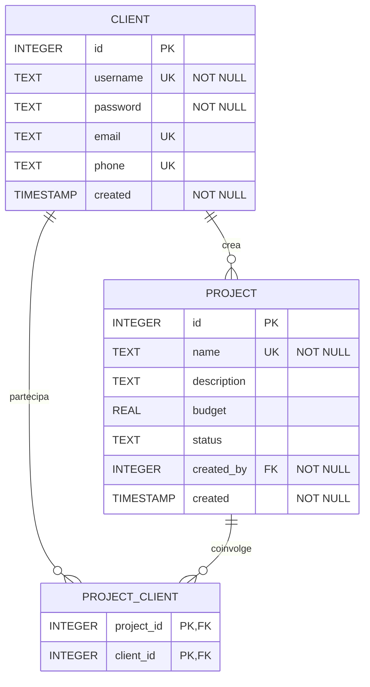

# Diagramma ER - Majima Construction

## Legenda

| Simbolo | Significato |
|---------|-------------|
| `PK` | Primary Key |
| `FK` | Foreign Key |
| `UK` | Unique Key |
| `\|\|--o{` | Uno a Molti (1:N) |
| `}o--o{` | Molti a Molti (N:N) |

## Relazioni

1. **CLIENT → PROJECT (1:N)**: Un client può creare molti progetti (tramite `created_by`)
2. **CLIENT → PROJECT_CLIENT (1:N)**: Un client può partecipare a molti progetti
3. **PROJECT → PROJECT_CLIENT (1:N)**: Un progetto può avere molti partecipanti
